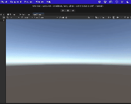

# Chapter 1: Unity's Input System Package

The goal of this chapter is to familiarize users with Unity's new input system, the Input System package. By the end of this chapter, readers will have built a game prototype using the Input System package.

## Installation

Unlike the old Input Manager, you need to install the new Input System package. On your Unity project, navigate to Window > Package Manager > Set Packages to Unity Registry > Search for Input System > <b>NOTE:</b> Installing the Input System package will disable the Input Manager > Install.

## The Player Input Component

The Player Input component enables flexible input handling. In the editor, you can define actions and map them to methods in C# scripts. Navigate to the player game object > Add Component > Search for Player Input > Select Create Actions. This will create an Input Actions Editor in your project's Assets folder.

On the Input Actions Editor, you will see 3 columns.

1. On the leftmost column is the Action Maps. An Action Map is a collection of actions that are related to each other. For example, in this pre-populated Input Actions Editor, you will see 2 Action Maps: One that handles player movement and one that handles UI navigation.
2. On the middle column is the Actions. An Action represents an event (i.e. walk, run, jump, attack) that can be triggered by an input. Here, you can change the input (i.e. button, key, joystick) that is binded to an Action. The bindings of an Action depends on the type of input device used. For example, in the above image, the Fire action is binded both to the left button on a mouse and a tap on a touchscreen. 
3. On the rightmost column is the Action Properties. In this panel, there are 3 sections.
* Action: 
* Interactions:
* Processors: 

## C# Scripts

Ensure that the proper library is linked

`using UnityEngine.Input`

## Resources
[Quickstart Guide](https://docs.unity3d.com/Packages/com.unity.inputsystem@1.13/manual/QuickStartGuide.html) 
[How to use Unity's New INPUT System EASILY](https://www.youtube.com/watch?v=HmXU4dZbaMw)
