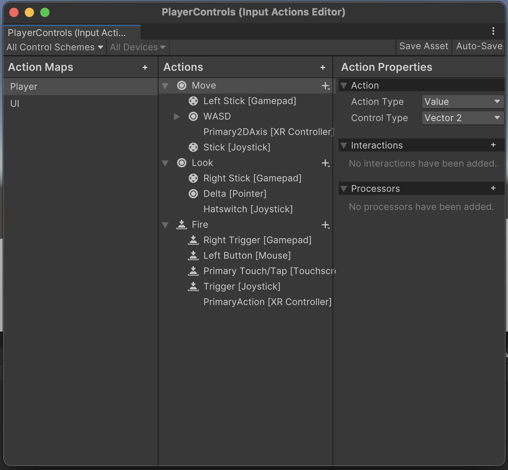

# Chapter 1: Unity's Input System Package

The goal of this chapter is to familiarize users with Unity's input system, the Input System package. By the end of this chapter, readers will have built a game prototype using the Input System package.

## Installation

Unlike the old Input Manager, you need to install the Input System package. On your Unity project, navigate to Window > Package Manager > Set Packages to Unity Registry > Search for Input System > <b>NOTE:</b> Installing the Input System package will disable the Input Manager > Install.

## The Player Input Component

<b>NOTE:</b> You do not need to follow along with this section in order to complete the example project. The Player Input component enables flexible input handling. In the editor, you can define actions and map them to methods in C# scripts. Navigate to the player game object > Add Component > Search for Player Input > Select Create Actions. This will create an Input Actions Editor in your project's Assets folder.

On the Input Actions Editor, you will see 3 columns.

1. On the leftmost column is the Action Maps. An Action Map is a collection of actions that are related to each other. For example, in this pre-populated Input Actions Editor, you will see 2 Action Maps: One that handles player movement and one that handles UI navigation.

2. On the middle column is the Actions. An Action represents an event (i.e. walk, run, jump, attack) that can be triggered by an input. Here, you can change the input (i.e. button, key, joystick) that is binded to an Action. The bindings of an Action depends on the type of input device used. For example, in the above image, the Fire action is binded both to the left button on a mouse and a tap on a touchscreen.

3. On the rightmost column is the Action Properties. In this panel, there are 3 sections.
    * Action: Here, you can select the Action's Action Type and Control Type. 
        * There are 3 possible Action Types: Value, Button, and PassThrough. 
            * A Value is used to pass continuous input. This is useful for things like player movement. 
            * A Button is used for discrete input. For example, the player has to press 'E' to interact with an object. 
            * A PassThrough is used to trigger a callback whenever a value is changed. This is useful when you want to process input from multiple devices without identifying a primary input device. 
        * The Control Type of an Action refers to the specific source through which the user can provide input. Unity offers a variety of Control Types included touch, integer, Vector2, Vector3, DPad, and more.
    * Interactions: An Interaction defines a specific input pattern for an Action. There are 4 types of Interactions.
        * Hold: The control must be held for a certain amount of time in order to trigger the Action
        * Press: The Action is triggered when the control is pressed and released within a specified amount of time
        * Slow Tap: The control must be held for a certain amount of time in order to trigger the Action (for touch input devices)
        * Tap: The Action is triggered as soon as the control is pressed and released within a specified amount of time (for touch input devices)
    * Processors: A Processor receives an input value and returns a modified result. There are 4 types of Processors.
        * Invert Vector 2: The received Vector2 input's X and/or Y values will be multiplied by -1
        * Normalize Vector 2: The received Vector2 input will be modified to have a magnitude of 1
        * Scale Vector 2: The received Vector2 input's components will be multiplied by a specified value
        * Stick Deadzone: Unwanted Vector2 input will be filtered out according to a designated threshold

## Tutorial

I am following along with BMo's introduction to Unity's Input System package on YouTube. If you want to head straight there, scroll down and click the link to the video titled "How to use Unity's New INPUT System EASILY. First, create a script to handle player movement. 

We will call it "Movement". Then, attach the script to the game object that represents the player. 

<!-- 
First, ensure that the proper library is linked

`using UnityEngine.InputSystem`

You can create an Input Action within a script by creating 
 -->

## Resources
[Quickstart Guide](https://docs.unity3d.com/Packages/com.unity.inputsystem@1.13/manual/QuickStartGuide.html) 
[How to use Unity's New INPUT System EASILY](https://www.youtube.com/watch?v=HmXU4dZbaMw)
